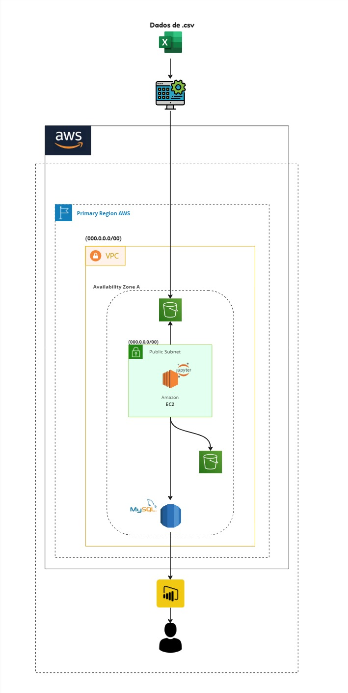

# 🛡️ Anti Plague: Análise Preditiva de Epidemias de Doenças Respiratórias 🛡️

## Objetivo Geral

Análise preditiva de Epidemias referente a Doenças Respiratórias.

## Objetivos Específicos

- Prever possíveis Epidemias com Base em Densidade Demográfica
- Analisar os Padrões de Imigração para Identificação precisa de Regiões de Alto Risco

## Introdução

Após o fim da pandemia da COVID-19, o mundo voltou a ficar alerta sobre possíveis epidemias e seus impactos sociais. Cientistas e pesquisadores do mundo todo investigam doenças todos os dias. Sendo assim, nosso objetivo é realizar uma pesquisa aplicada para buscar prever possíveis epidemias através de análises de dados reais, com ênfase na densidade demográfica do local e seus padrões de imigração.

## Arquitetura

